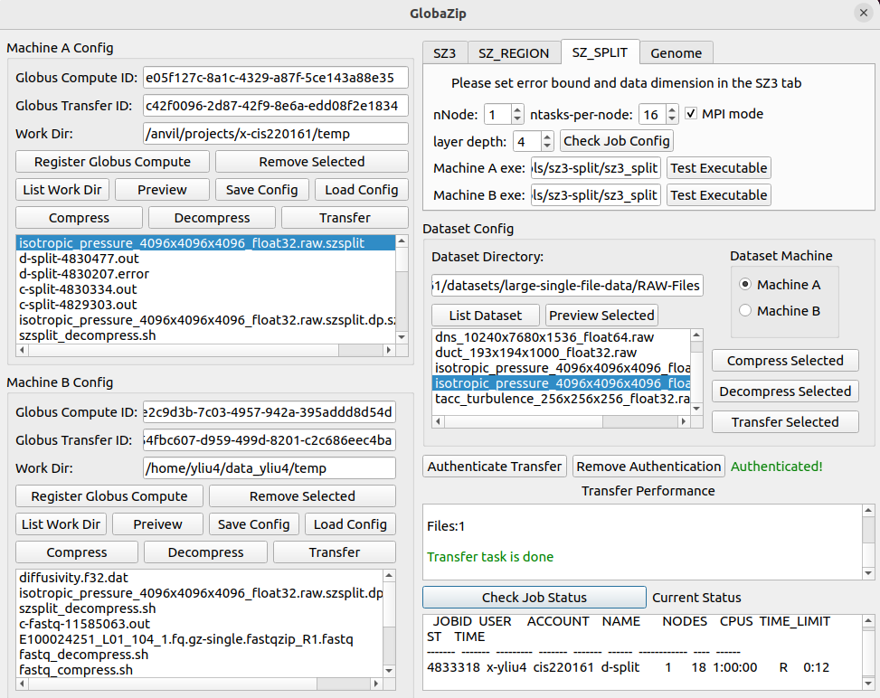
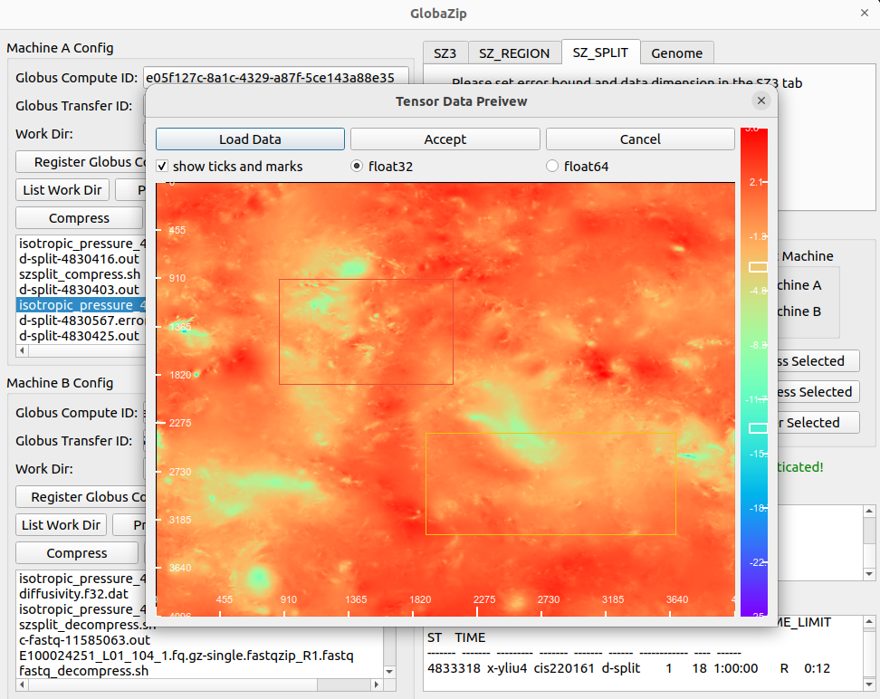

# GlobaZip

GlobaZip is a compression and transfer framework that orchestrates tasks on remote machines. Currently, we suppport two types of data: floating-point tensors and genome sequence data. The floating-point tensor data files are usually planar (e.g. [CESM dataset](https://climatedata.ibs.re.kr/data/cesm2-lens) 1800x3600) or cubic (e.g. [Nyx dataset](https://ieee-dataport.org/open-access/nyx-cosmological-simulation-dataset) 512x512x512). Some extremely large single file can be over 900 GB (e.g. [Turbulent Channel Flow](https://klacansky.com/open-scivis-datasets/category-simulation.html) 10240x7680x1536). For genome sequence data, many are distributed in gzipped FastQ files. Some example datasets include [CNX0547764](https://db.cngb.org/search/experiment/CNX0547764/), [CNX0145971](https://db.cngb.org/search/experiment/CNX0145971/), and [BGISEQ500](https://ftp-trace.ncbi.nlm.nih.gov/ReferenceSamples/giab/data/NA12878/BGISEQ500/). We provide a novel algorithm to further compress those files with a reference sequence. The goal of this project is to provide a friendly user-interface for users to compress, transfer and store these huge datasets.

## New Features

- Support compression of extremely large single file with layer-by-layer compression techniques and allows NUMA compression with multiple nodes.
- Include genome sequence compression and support parallel compression.
- Intuitive way to set multiple errorbounds for different value ranges/regions with SZ_REGION compression.
- PyQt5 user interface
- Easier Benchmarking of multiple datasets and multiple compressors
- Upgrade to the Globus Compute SDK

## Old Features

- Basic user interface with tkinter
- Support compression (on Machine A) + transfer (via Globus) + decompression (on Machine B) workflow.
- SZ3-specific feature extraction
- Prediction of compression ratio and time with Machine Learning models

## Get Started

### Configure remote machines

We provide examples in `examples/machines_config`. If you have access to Purdue Anvil or John Hopkins Rockfish, you are recommended to start with these two machines as we have tested on these two. If you have access to exclusive systems such as Alibaba ECS, you can also set up the endpoints there.

```yaml
name: Rockfish
globus_compute_id: 0e2c9d3b-7c03-4957-942a-395addd8d54d
globus_transfer_id: 54fbc607-d959-499d-8201-c2c686eec4ba
globus_client_id: 1fb9c8a9-1aff-4d46-9f37-e3b0d44194f2
work_dir: /home/yliu4/data_yliu4/temp
defaults:
  job_account: yliu4
  user: yliu4
  partition: shared
  multi_node_partition: parallel
  dataset_dir: /home/yliu4/data_yliu4/NYX_512x512x512
  sz3_exe: /home/yliu4/SZ3/build/tools/sz3/sz3
  sz_split_exe: /home/yliu4/SZ3/build/tools/sz3-split/sz3_split
  sz_region_exe: /home/yliu4/region/SZ3/build/test/sz_region
  fastqzip_exe: /home/yliu4/genome/ad/fastqZip/build/fastqZip
  reference_path: /home/yliu4/data_yliu4/genome-data/reference/Homo_sapiens_assembly38.fasta
```

A configuration file includes the above fields. Specify a `name` for the machine. You can get the `globus_compute_id` on that machine after setting up the globus endpoint. The `globus_transfer_id` is usually set up for multiple users in advance on supercomputers. You can go to [Globus Web App](https://app.globus.org) to find the collection and obtain the transfer id there. The `globus_client_id` is an id for the application. We recommend users read the [Globus Compute Documentation](https://globus-compute.readthedocs.io/en/latest/quickstart.html) to set up the endpoints. We provide a simplified way to set up a globus compute endpoint (note that you need some kind of conda environment on your machine).

```bash
module load anaconda/2021.05-py38
conda create --name globazip python=3.11
conda activate globazip
pip install globus-compute-endpoint matplotlib
globus-compute-endpoint configure
```

In the `~/.globus_compute/default` folder, there is a `config.yaml` file, we need to add a `worker_init` field to initilize the endpoint with our conda environment.

```yaml
amqp_port: 443
display_name: null
engine:
    provider:
        worker_init: module load anaconda/2021.05-py38 && conda activate globazip
        init_blocks: 1
        max_blocks: 1
        min_blocks: 0
        type: LocalProvider
    type: GlobusComputeEngine
```

The `work_dir` is where the compressed/decompressed files, batch job files and other data metrics files will be stored. You can change it later in the app. The configuration serves as a convenient method to load everything in one click at the beginning. The `defaults` contains important information about submitting batch jobs and the compressor executable paths. We currently support 4 compressors: sz3, sz_split, sz_region, fastqzip. More compressors can be added into the framework. In the `scripts` folder, we provide the scripts to install the compressors. Make sure you install the compressors in the configured remote machines instead of your laptop.

### Run the local app

This repo is a GUI-based app that makes remote function calls to run (de)compression/transfer on multiple computing clusters. To run the app, create a conda virutal environment locally and install the dependencies with the following commands.

```bash
conda create --name globazip python=3.11
conda activate globazip
pip install -r requirements.txt
```

Then you can start the GUI app by running the `pyqt5app.py`. Please ensure that you run the app in a system that supports some type of graphical interfaces. Our program uses PyQt5 to create the GUI.

```bash
python pyqt5app.py
```

The interface looks like the following, and users should use the `Load Config` buttons to load the configuration for two machines. 



The data preview looks like the following. Users can accept the setting and use SZ_REGION to compress one data file with multiple error bound settings.



SZ_SPLIT and Genome compression will submit a batch job as they target at compressing very large files that do not fit into memory and takes relatively long time. SZ_REGION and SZ3 directly run the program on the target machine. For supercomputers, they are usually the login nodes and users should not run heavy compression jobs on them.